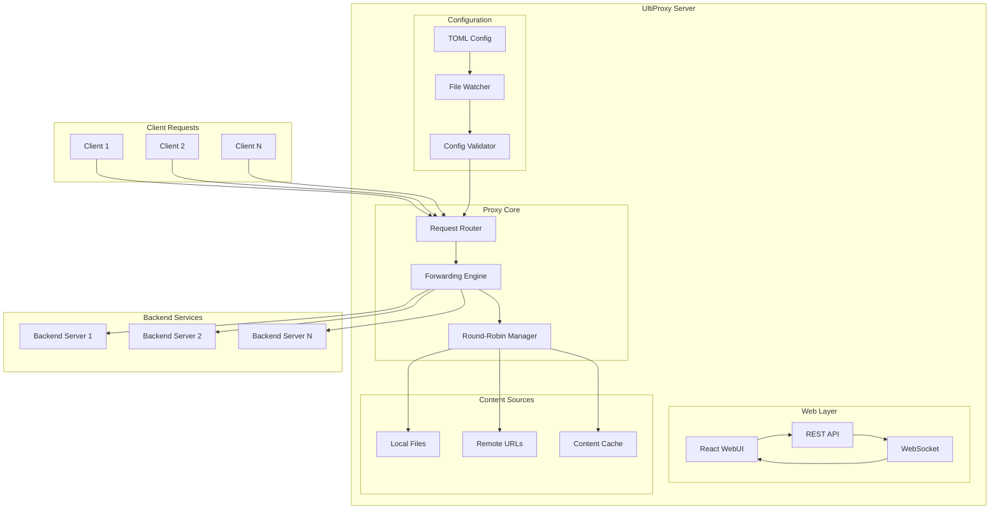
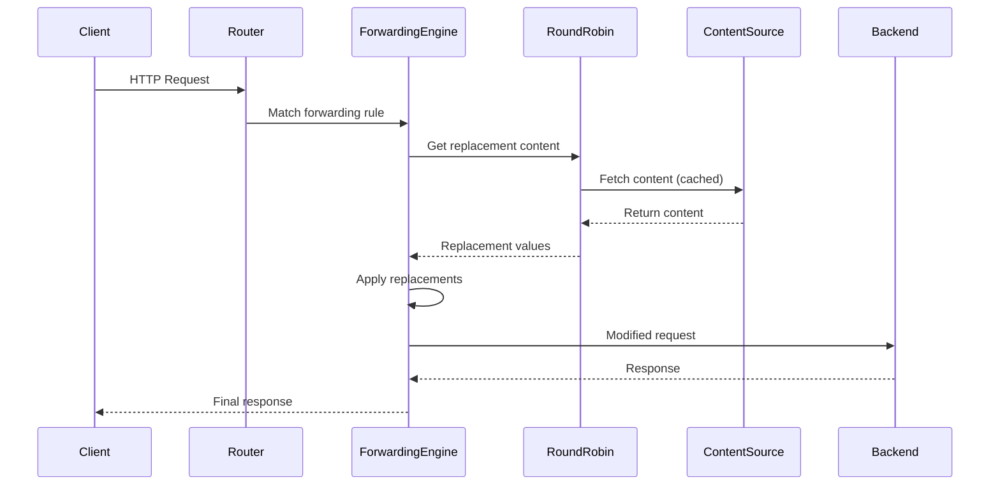
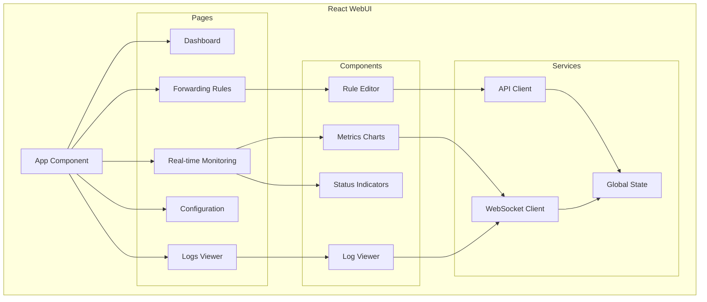

# UltiProxy - HTTP Forwarding Service Architecture Plan

## Project Overview

**UltiProxy** is a sophisticated HTTP proxy service that supports:
- Multiple configurable forwarding rules
- Dynamic header/content replacement with round-robin load balancing
- React-based WebUI for management and monitoring
- TOML configuration with hot-reload capability
- Support for both local files and remote URLs as content sources

## Technology Stack

### Backend (Rust)
- **[`axum`](https://github.com/tokio-rs/axum)** - Web framework for HTTP server and API
- **[`reqwest`](https://github.com/seanmonstar/reqwest)** - HTTP client for forwarding requests
- **[`serde`](https://github.com/serde-rs/serde)** + **[`toml`](https://github.com/toml-rs/toml)** - Configuration serialization
- **[`tokio`](https://github.com/tokio-rs/tokio)** - Async runtime
- **[`tower`](https://github.com/tower-rs/tower)** + **[`tower-http`](https://github.com/tower-rs/tower-http)** - Middleware
- **[`tracing`](https://github.com/tokio-rs/tracing)** - Logging and monitoring
- **[`notify`](https://github.com/notify-rs/notify)** - File watching for config hot-reload

### Frontend (React)
- **React 18** with TypeScript
- **Vite** for build tooling
- **Tailwind CSS** for styling
- **React Query** for API state management
- **React Router** for navigation
- **Socket.io** for real-time updates

## System Architecture



## Core Components Design

### 1. Configuration Structure (TOML)

```toml
[server]
host = "0.0.0.0"
port = 8080
web_ui_port = 3000

[logging]
level = "info"
file = "ultiproxy.log"

[[forwarding_rules]]
name = "api_proxy"
path = "/api/*"
target_urls = ["http://backend1:8080", "http://backend2:8080"]
load_balancing = "round_robin"

[forwarding_rules.header_replacements]
"X-Custom-Header" = { source = "file", path = "./headers/custom.txt", split_by = "line" }
"Authorization" = { source = "remote", url = "https://auth.example.com/tokens", split_by = "comma" }

[forwarding_rules.body_replacements]
"{{API_KEY}}" = { source = "file", path = "./keys/api_keys.txt", split_by = "line" }

[[forwarding_rules]]
name = "static_proxy"
path = "/static/*"
target_urls = ["http://cdn1.example.com", "http://cdn2.example.com"]
load_balancing = "round_robin"
```

### 2. Request Flow Architecture



### 3. WebUI Component Structure



## Implementation Plan

### Phase 1: Core Proxy Engine (Week 1-2)
1. **Project Setup**
   - Initialize Rust project with proper dependencies
   - Set up basic Axum server structure
   - Implement TOML configuration parsing

2. **Basic Forwarding**
   - Implement request routing based on path patterns
   - Basic HTTP forwarding to target URLs
   - Simple round-robin load balancing

3. **Content Replacement Engine**
   - File-based content source reader
   - Basic header and body replacement
   - Round-robin content selection

### Phase 2: Advanced Features (Week 2-3)
1. **Remote Content Sources**
   - HTTP client for fetching remote content
   - Caching mechanism for remote content
   - Error handling and fallback strategies

2. **Configuration Management**
   - Hot-reload capability with file watching
   - Configuration validation
   - Runtime configuration updates

3. **Monitoring & Logging**
   - Structured logging with tracing
   - Metrics collection (request count, latency, errors)
   - Health check endpoints

### Phase 3: WebUI Development (Week 3-4)
1. **React Frontend Setup**
   - Vite + React + TypeScript project setup
   - Tailwind CSS integration
   - Basic routing and layout

2. **API Integration**
   - REST API for configuration management
   - WebSocket for real-time updates
   - State management with React Query

3. **UI Components**
   - Forwarding rules management interface
   - Real-time monitoring dashboard
   - Log viewer with filtering
   - Configuration editor

### Phase 4: Production Features (Week 4-5)
1. **Security & Performance**
   - Rate limiting middleware
   - Request/response size limits
   - Security headers

2. **Deployment & Operations**
   - Docker containerization
   - Health checks and graceful shutdown
   - Configuration examples and documentation

3. **Testing & Documentation**
   - Unit tests for core components
   - Integration tests for proxy functionality
   - API documentation
   - User guide

## File Structure

```
ultiproxy/
├── Cargo.toml
├── src/
│   ├── main.rs
│   ├── config/
│   │   ├── mod.rs
│   │   ├── types.rs
│   │   └── watcher.rs
│   ├── proxy/
│   │   ├── mod.rs
│   │   ├── engine.rs
│   │   ├── router.rs
│   │   └── round_robin.rs
│   ├── content/
│   │   ├── mod.rs
│   │   ├── sources.rs
│   │   └── cache.rs
│   ├── api/
│   │   ├── mod.rs
│   │   ├── handlers.rs
│   │   └── websocket.rs
│   └── monitoring/
│       ├── mod.rs
│       ├── metrics.rs
│       └── logging.rs
├── web-ui/
│   ├── package.json
│   ├── vite.config.ts
│   ├── src/
│   │   ├── main.tsx
│   │   ├── App.tsx
│   │   ├── components/
│   │   ├── pages/
│   │   ├── services/
│   │   └── types/
│   └── public/
├── config/
│   └── ultiproxy.toml
├── examples/
│   ├── basic-config.toml
│   └── advanced-config.toml
└── docs/
    ├── API.md
    ├── Configuration.md
    └── Deployment.md
```

## Key Features Summary

1. **Multi-Rule Forwarding**: Support for multiple forwarding rules with path-based routing
2. **Dynamic Content Replacement**: Headers and body content replacement with round-robin selection
3. **Flexible Content Sources**: Both local files and remote URLs as content sources
4. **Hot Configuration Reload**: Real-time configuration updates without service restart
5. **React WebUI**: Modern web interface for management and monitoring
6. **Real-time Monitoring**: Live metrics, logs, and status updates
7. **Production Ready**: Security, performance, and operational features

## Technical Specifications

### API Endpoints

#### Configuration Management
- `GET /api/config` - Get current configuration
- `PUT /api/config` - Update configuration
- `POST /api/config/reload` - Reload configuration from file

#### Forwarding Rules
- `GET /api/rules` - List all forwarding rules
- `POST /api/rules` - Create new forwarding rule
- `PUT /api/rules/{id}` - Update forwarding rule
- `DELETE /api/rules/{id}` - Delete forwarding rule

#### Monitoring
- `GET /api/metrics` - Get system metrics
- `GET /api/health` - Health check endpoint
- `GET /api/logs` - Get recent logs
- `WebSocket /ws/events` - Real-time events stream

### Performance Requirements
- **Latency**: < 10ms additional latency for proxy requests
- **Throughput**: Support 1000+ concurrent connections
- **Memory**: Efficient caching with configurable limits
- **CPU**: Minimal overhead for content replacement operations

### Security Considerations
- **Input Validation**: Strict validation of all configuration inputs
- **Rate Limiting**: Configurable rate limits per client/endpoint
- **Access Control**: Optional authentication for WebUI access
- **Secure Headers**: Automatic security header injection

This architecture provides a solid foundation for a scalable, maintainable HTTP proxy service with modern tooling and comprehensive management capabilities.