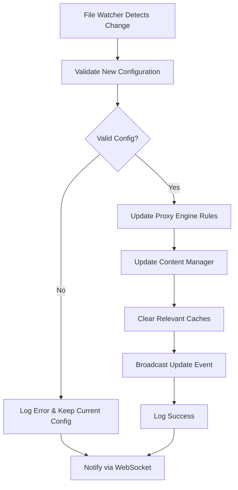
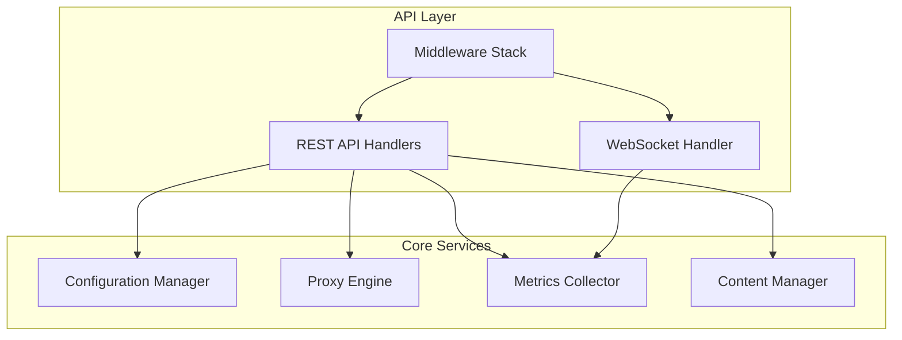
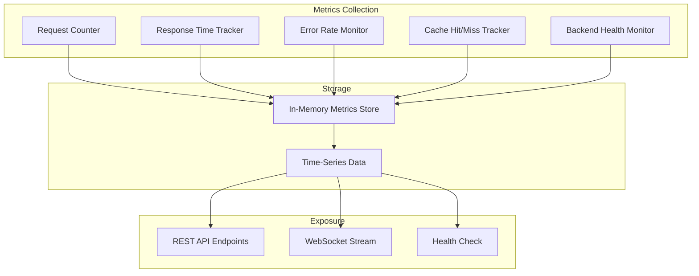

# Phase 2 Implementation Plan: Advanced Features & API Development

## Project Status Overview

**Current Phase:** Completing Phase 2 - Advanced Features
**Target:** Complete API endpoints, configuration hot-reload, and enhanced monitoring
**Next Phase:** Phase 3 - WebUI Development

## Current State Analysis

### ✅ Already Implemented (Phase 1)
- Core proxy engine with routing and load balancing
- Content replacement system (file and remote sources)
- Configuration file parsing and validation
- File watcher for configuration changes (basic implementation)
- Content caching system
- Structured logging with tracing
- Graceful shutdown handling

### 🚧 Partially Implemented
- Configuration hot-reload (file watcher exists but not integrated)
- Remote content sources (basic implementation done)

### ❌ Missing for Phase 2 Completion
- API endpoints for runtime configuration management
- Configuration hot-reload integration with proxy engine
- Enhanced monitoring and metrics collection
- WebSocket support for real-time updates
- Comprehensive error handling and fallback strategies

## Detailed Implementation Plan

### 1. Complete Configuration Hot-Reload Integration



**Implementation Tasks:**
- Integrate `ConfigWatcher` with main application loop
- Add configuration reload handler in `main.rs`
- Update `ProxyEngine` to handle rule updates
- Add validation before applying new configuration
- Implement graceful fallback on invalid configuration

**Files to Modify:**
- `src/main.rs` - Add config reload handling
- `src/config/watcher.rs` - Enhance with validation integration
- `src/proxy/engine.rs` - Add hot-reload support

### 2. API Endpoints for Runtime Management



#### API Endpoints to Implement

##### Configuration Management
- `GET /api/config` - Get current configuration
- `PUT /api/config` - Update entire configuration
- `POST /api/config/reload` - Force reload from file
- `POST /api/config/validate` - Validate configuration without applying

##### Forwarding Rules Management
- `GET /api/rules` - List all forwarding rules
- `POST /api/rules` - Create new forwarding rule
- `PUT /api/rules/{name}` - Update specific forwarding rule
- `DELETE /api/rules/{name}` - Delete forwarding rule
- `POST /api/rules/{name}/test` - Test rule against sample request

##### Content Management
- `GET /api/content/sources` - List all content sources
- `POST /api/content/cache/clear` - Clear content cache
- `DELETE /api/content/cache/{source}` - Clear specific source cache
- `GET /api/content/cache/stats` - Get cache statistics

##### Monitoring & Metrics
- `GET /api/metrics` - Get system metrics
- `GET /api/health` - Enhanced health check with details
- `GET /api/status` - Get proxy status and statistics
- `WebSocket /ws/events` - Real-time events stream

### 3. Enhanced Monitoring & Metrics Collection



**Metrics to Implement:**
- Request count per rule/endpoint
- Response times (min/max/avg/p95/p99)
- Error rates and status code distribution
- Cache hit/miss ratios
- Backend availability and response times
- Active connections count
- Memory and CPU usage

**Data Structures:**
```rust
pub struct SystemMetrics {
    pub request_count: u64,
    pub error_count: u64,
    pub avg_response_time: f64,
    pub cache_hit_ratio: f64,
    pub active_connections: u32,
    pub uptime: Duration,
    pub rule_metrics: HashMap<String, RuleMetrics>,
}

pub struct RuleMetrics {
    pub request_count: u64,
    pub error_count: u64,
    pub avg_response_time: f64,
    pub backend_health: HashMap<String, BackendHealth>,
}
```

### 4. WebSocket Support for Real-Time Updates

**Events to Stream:**
- Configuration changes
- Rule updates
- Metrics updates (every 5 seconds)
- Error events
- Cache operations
- Backend health changes

**WebSocket Message Format:**
```json
{
  "type": "metrics_update",
  "timestamp": "2025-06-28T08:30:00Z",
  "data": {
    "request_count": 1234,
    "error_rate": 0.02,
    "avg_response_time": 45.6
  }
}
```

### 5. Enhanced Error Handling & Fallback Strategies

**Improvements:**
- Circuit breaker pattern for backend failures
- Retry logic with exponential backoff
- Fallback content sources
- Graceful degradation on partial failures
- Comprehensive error logging and reporting

**Circuit Breaker Implementation:**
```rust
pub struct CircuitBreaker {
    state: CircuitState,
    failure_count: u32,
    failure_threshold: u32,
    timeout: Duration,
    last_failure_time: Option<Instant>,
}

pub enum CircuitState {
    Closed,
    Open,
    HalfOpen,
}
```

## File Structure for New Components

```
src/
├── api/                    # New API module
│   ├── mod.rs
│   ├── handlers/
│   │   ├── mod.rs
│   │   ├── config.rs       # Configuration API handlers
│   │   ├── rules.rs        # Rules management handlers
│   │   ├── content.rs      # Content management handlers
│   │   └── metrics.rs      # Metrics API handlers
│   ├── websocket.rs        # WebSocket handler
│   ├── middleware.rs       # API middleware
│   └── types.rs           # API request/response types
├── monitoring/             # New monitoring module
│   ├── mod.rs
│   ├── metrics.rs         # Metrics collection
│   ├── collector.rs       # Metrics collector service
│   └── events.rs          # Event system
├── circuit_breaker/        # New circuit breaker module
│   ├── mod.rs
│   └── breaker.rs         # Circuit breaker implementation
└── main.rs                # Updated with API routes
```

## Implementation Sequence

### Week 1: Core API Infrastructure
**Day 1-2**: Create API module structure and basic handlers
- Set up `src/api/` module structure
- Implement basic Axum routing for API endpoints
- Add request/response types and validation
- Create middleware for logging and error handling

**Day 3-4**: Implement configuration management endpoints
- `GET /api/config` - Return current configuration
- `PUT /api/config` - Update configuration with validation
- `POST /api/config/reload` - Force reload from file
- `POST /api/config/validate` - Validate without applying

**Day 5**: Add middleware and error handling
- Request logging middleware
- Error response formatting
- Rate limiting (basic implementation)
- CORS configuration for future WebUI

### Week 2: Monitoring & WebSocket
**Day 1-2**: Implement metrics collection system
- Create `SystemMetrics` and `RuleMetrics` structures
- Implement metrics collector service
- Add metrics tracking to proxy engine
- Create in-memory time-series storage

**Day 3-4**: Add WebSocket support and real-time events
- Implement WebSocket handler for `/ws/events`
- Create event broadcasting system
- Add real-time metrics streaming
- Implement event filtering and subscription

**Day 5**: Integrate monitoring with existing components
- Add metrics collection to all proxy operations
- Implement cache statistics tracking
- Add backend health monitoring
- Create comprehensive health check endpoint

### Week 3: Hot-Reload & Advanced Features
**Day 1-2**: Complete configuration hot-reload integration
- Integrate `ConfigWatcher` with main application
- Add configuration validation pipeline
- Implement graceful rule updates
- Add rollback on validation failure

**Day 3-4**: Add enhanced error handling and fallback strategies
- Implement circuit breaker pattern
- Add retry logic with exponential backoff
- Create fallback content source system
- Enhance error logging and reporting

**Day 5**: Testing and optimization
- Integration testing for all API endpoints
- Performance testing for metrics collection
- WebSocket connection stability testing
- Configuration hot-reload testing

## Dependencies to Add

```toml
# Add to Cargo.toml
serde_json = "1.0"           # JSON serialization for API
axum-extra = "0.9"           # Additional Axum features
tokio-tungstenite = "0.21"   # WebSocket support
metrics = "0.22"             # Metrics collection
metrics-exporter-prometheus = "0.13"  # Prometheus metrics export
tower-http = { version = "0.5", features = ["cors", "trace", "fs", "limit"] }
```

## API Documentation Structure

### Configuration API
```yaml
/api/config:
  get:
    summary: Get current configuration
    responses:
      200:
        description: Current configuration
        content:
          application/json:
            schema:
              $ref: '#/components/schemas/Config'
  put:
    summary: Update configuration
    requestBody:
      required: true
      content:
        application/json:
          schema:
            $ref: '#/components/schemas/Config'
    responses:
      200:
        description: Configuration updated successfully
      400:
        description: Invalid configuration
```

## Testing Strategy

### Unit Tests
- API endpoint handlers
- Metrics collection functions
- Configuration validation
- Circuit breaker logic

### Integration Tests
- End-to-end API workflows
- Configuration hot-reload scenarios
- WebSocket event streaming
- Proxy functionality with new features

### Performance Tests
- API response times under load
- Metrics collection overhead
- WebSocket connection limits
- Memory usage with metrics storage

## Success Criteria

**Phase 2 will be complete when:**
- ✅ Configuration can be updated via API without restart
- ✅ All API endpoints are functional and documented
- ✅ Real-time metrics are available via WebSocket
- ✅ Hot-reload works seamlessly with validation
- ✅ Comprehensive error handling is in place
- ✅ System is production-ready for Phase 3 (WebUI)

## Monitoring & Observability

### Key Metrics to Track
1. **Request Metrics**
   - Total requests per second
   - Response time percentiles (p50, p95, p99)
   - Error rate by status code
   - Requests per forwarding rule

2. **System Metrics**
   - Memory usage
   - CPU utilization
   - Active connections
   - Cache hit/miss ratios

3. **Backend Metrics**
   - Backend response times
   - Backend availability
   - Load balancing distribution
   - Circuit breaker state changes

### Alerting Thresholds
- Error rate > 5%
- Response time p95 > 1000ms
- Backend availability < 90%
- Memory usage > 80%

## Security Considerations

### API Security
- Input validation for all endpoints
- Rate limiting per client IP
- Authentication for sensitive operations (future)
- HTTPS enforcement (production)

### Configuration Security
- Validation of file paths (prevent directory traversal)
- URL validation for remote sources
- Sanitization of user inputs
- Audit logging for configuration changes

This comprehensive plan provides a solid foundation for completing Phase 2 and preparing for Phase 3 (WebUI development). All backend APIs and real-time capabilities will be in place to support a rich web interface.